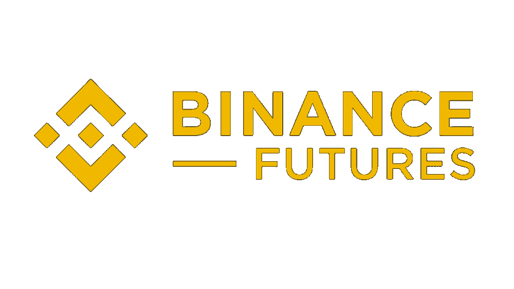

<div>

</div>


### Cloning the Repository
```bash
git clone https://github.com/Davda-James/binance-trading-bot
```

### Setting Up the Environment
Note: Make sure you have uv installed because this project uses uv package manager.

```bash
uv pip install -r pyproject.toml
```

### Running the BINANCE CLI
```bash
uv run main.py
```

### Testing Demos

#### Landing


---
#### Viewing the accounts and balances


---
#### Viewing the  of complete history/errors/trades


---
#### Checking out all orders and status


---
#### Fuzzy Search in symbols and trading base assets


---
#### Order Types


---
#### Place Order (BUY/Sell) 


#### Proof of Order on [Binance Futures Testnet](testnet.binancefuture.com) (SELL that we did in previous)
    

---
#### TWAP Order (SELL/STOP_LIMIT)


---
#### TWAP DICT/LIST


---
#### GRID Order


